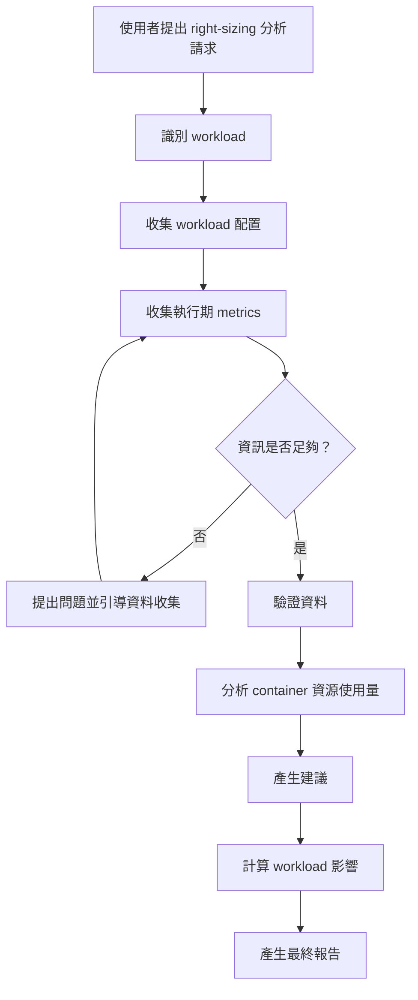
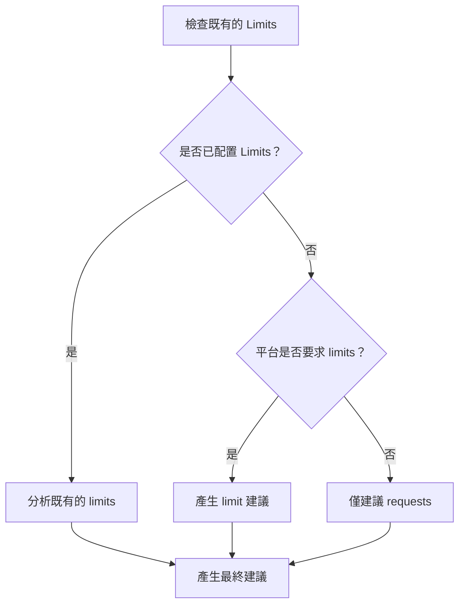

# Skill：Kubernetes 資源合理化配置建議（Resource Right-Sizing Recommendation）

## 摘要（Summary）

引導 Platform Engineer 完成分析正在執行中的 Kubernetes workload、驗證執行期資源使用量，並產生安全、可解釋的資源合理化配置建議。

此 Skill 支援互動式工作流程，讓使用者可以在資訊有限的情況下開始使用。此 Skill 會識別缺少的資訊、引導使用者收集所需的執行期資料、驗證已收集的資訊，並產生 container 層級的 CPU 與 Memory 建議。

此 Skill 專注於根據實際 workload 行為，進行**部署後的 workload 最佳化（post-deployment workload optimization）**。

—

# 問題描述（Problem Statement）

Kubernetes 資源配置是 Platform Engineer 最常遇到的挑戰之一。

不正確的資源配置可能導致：

- 因過度配置（over-provisioning）造成基礎設施成本浪費。
- 因配置不足（under-provisioning）造成應用程式不穩定。
- 叢集容量規劃不佳。
- Node 使用效率低落。

雖然 Kubernetes 的資源配置設定很簡單，但要決定正確的數值，需要理解：

- 目前的 workload 配置。
- 實際的執行期資源消耗。
- Workload 的行為模式。
- 平台的資源政策。

許多工程師並不清楚：

- 需要哪些 metrics。
- 需要多少歷史資料才足夠。
- 如何解讀 workload 的行為。
- Resource requests 與 limits 是否符合平台的要求。

此 Skill 提供一套引導式工作流程，協助使用者得出以資料為依據的建議。

—

# 範疇（Scope）

## Version 1 目標

分析**目前正在執行中的 Kubernetes workload**，並使用其執行期歷史 metrics。

此 Skill 需要：

```
執行中的 Kubernetes workload
+
執行期 metrics
=
資源建議
```

—

# 分析目標（Analysis Target）

## 支援項目（Supported）

Version 1 支援：

- Deployment
- StatefulSet
- DaemonSet

目標 workload 必須已存在於 Kubernetes 叢集中。

—

## 不支援項目（Not Supported）

Version 1 不會分析：

- 沒有執行期資料的獨立 YAML 檔案。
- 部署前（pre-deployment）的 manifest。
- Job
- CronJob
- VirtualMachine

靜態 YAML 審查應作為另一個獨立的 Skill 實作。

範例：

```
Resource Right-Sizing Skill

        vs

Kubernetes Manifest Review Skill
```

—

# 目標（Goals）

此 Skill 應該：

- 透過對話理解 workload 的背景脈絡。
- 收集所需的執行期資訊。
- 引導使用者取得缺少的 metrics。
- 在 container 層級分析資源。
- 考慮 replica 的影響。
- 考慮既有的 resource limits 與平台政策。
- 產生可解釋的建議。
- 提供信心水準（confidence levels）。

—

# 分析單位（Analysis Unit）

Kubernetes 的 resource requests 與 limits 是在 container 層級設定的。

因此：

> 分析的單位是 Kubernetes container，而不是 Pod。

此 Skill 必須獨立分析每一個 container。

一個 Pod 可能包含：

- 應用程式 container
- Service mesh sidecar
- 日誌收集 agent
- 監控 agent
- 其他基礎設施 container

此 Skill 不應該只提供 Pod 層級的建議。

—

# 互動式工作流程（Interactive Workflow）

此 Skill 應引導使用者完成一套互動式流程。



—

# 所需資訊（Required Information）

## Workload 配置

必要：

- Kubernetes workload manifest
- Container 名稱
- CPU requests
- Memory requests
- Replica 數量

選填：

- Resource limits
- HPA 配置
- Pod restart 歷史紀錄

—

# 執行期 Metrics（Runtime Metrics）

必要：

CPU：

- 歷史 CPU 使用量

Memory：

- 歷史 Memory 使用量


建議的觀察期間：

```
>= 7 天
```

最低可接受：

```
>= 24 小時
```

若觀察期間不足，此 Skill 應降低信心水準。

—

# Replica 處理方式（Replica Handling）

## 建議範疇（Recommendation Scope）

Replica 數量不會直接影響 container 的資源建議。

此建議回答的問題是：

> 每一個 container instance 應該 request 多少 CPU 與 Memory？

範例：

Deployment：

```
Replica 數量：10
```

建議：

```
CPU Request：

每個 container 300m
```

而不是：

```
每個 container 3000m
```

—

## 考慮 Replica 的影響分析（Replica-aware Impact Analysis）

Replica 數量會用於計算 workload 層級的整體影響。

範例：

目前：

```
Replicas：
10

CPU Request：
1000m
```

總計：

```
10 × 1000m

= 10000m CPU
```

建議：

```
CPU Request：
300m
```

總計：

```
10 × 300m

= 3000m CPU
```

此 Skill 應回報：

- 總資源縮減量
- 潛在的容量改善空間
- 預估成本影響（未來增強項目）

—

# 多 Replica Metrics 彙總（Multi-replica Metrics Aggregation）

當存在多個 replica 時：

此 Skill 應先彙總所有 container instance 的 metrics，再計算百分位數（percentile）。


除非只有一個 replica，否則此 Skill 不應僅根據單一 Pod 計算建議。

—

# Resource Limits 處理方式（Resource Limits Handling）

## Resource Limits 的用途

Resource limits 並非主要的最佳化目標。

Resource requests 是根據 workload 使用量進行最佳化的對象。

收集 resource limits 的原因是它們能提供：

- 容量規劃的背景脈絡。
- 風險評估依據。
- Request / limit 關係的驗證。

—

# Resource Limit 決策邏輯（Resource Limit Decision Logic）



—

# 已存在的 Resource Limits（Existing Resource Limits）

若已配置 limits：

此 Skill 應該：

- 分析目前的 request / limit 比例。
- 在適當的情況下建議更新後的 limits。
- 除非 workload 行為顯示有必要調整，否則應維持既有的比例。

範例：

目前：

```yaml
requests:
  cpu: 1000m

limits:
  cpu: 2000m
```

比例：

```
2x
```

建議：

```
Request：
300m

Limit：
600m
```

—

# 未設定 Resource Limits（No Existing Resource Limits）

若尚未配置 limits：

此 Skill 預設不應自動建立 limits。

此 Skill 應詢問：

```
您的 Kubernetes 平台是否要求設定 resource limits？
```

可能的回答：

```
1. 是
2. 否
3. 不確定
```

若回答：

```
否
```

此 Skill 僅建議 requests。

若回答：

```
是
```

此 Skill 會根據平台政策產生 limit 建議。

—

# Sizing 方法論（Sizing Methodology）

此 Skill 採用以百分位數（percentile）為基礎的資源分析方式。

目標：

> 涵蓋 workload 的正常尖峰使用量，同時避免不必要的過度配置。

—

# CPU 建議（CPU Recommendation）

公式：

```
Recommended CPU Request =
CPU P95 Usage × CPU Safety Factor
```

預設值：

```
CPU Safety Factor = 1.2
```

範例：

```
目前 Request：

1000m


CPU P95：

250m


建議：

250m × 1.2

= 300m
```

—

# Memory 建議（Memory Recommendation）

公式：

```
Recommended Memory Request =
Memory P95 Usage × Memory Safety Factor
```

預設值：

```
Memory Safety Factor = 1.25
```

範例：

```
目前 Request：

2Gi


Memory P95：

700Mi


建議：

700Mi × 1.25

= 875Mi

捨入後：

896Mi
```

—

# 建議數值捨入規則（Recommendation Rounding）

此 Skill 應將建議值向上捨入為 Kubernetes 慣用的數值。

捨入的目的是：

- 避免建議值低於計算出的需求。
- 維持安全邊際（safety margin）。
- 提供可預期、一致的建議。

此 Skill 絕不能將資源建議值向下捨入。

捨入是在套用 safety factor 之後進行。當 limit 建議是根據既有的 request / limit 比例產生時，該比例會套用在**已捨入的 request** 上，產生的 limit 再依相同規則進行捨入。

—

## CPU 捨入規則

CPU 建議值應向上捨入至最接近的 50m。

範例：

```
264m --> 300m

310m --> 350m

501m --> 550m
```

—

## Memory 捨入規則

Memory 建議值依數值大小採用不同的捨入級距。

小於 1Gi 時：

向上捨入至最接近的 128Mi。

範例：

```
300Mi --> 384Mi

700Mi --> 768Mi

875Mi --> 896Mi
```

大於或等於 1Gi 時：

向上捨入至最接近的 256Mi。

範例：

```
1.1Gi --> 1.25Gi

1.6Gi --> 1.75Gi
```

—

## 平台覆寫（Platform Override）

預設的捨入政策可依平台特定的要求覆寫。

範例：

- 內部 Kubernetes 平台標準。
- 雲端服務商建議值。
- 企業容量規劃規則。

—

# 建議門檻值（Recommendation Thresholds）

## CPU 過度配置（Over-provisioning）

判定條件：

```
目前 CPU Request >
建議 CPU Request × 2
```

—

## Memory 過度配置（Over-provisioning）

判定條件：

```
目前 Memory Request >
建議 Memory Request × 1.5
```

額外檢查項目：

- 無 Memory 使用量持續上升的趨勢。
- 近期無 OOM 事件。

—

## CPU 配置不足（Under-provisioning）

判定條件：

```
CPU P95 使用量 >
目前 CPU Request × 0.8
```

—

## Memory 配置不足（Under-provisioning）

判定條件：

```
Memory P95 使用量 >
目前 Memory Request × 0.9
```

或：

- 偵測到 OOMKilled 事件。
- Memory 使用量持續上升。

—

# 信心水準模型（Confidence Model）

每一項建議都必須附帶信心水準。

## 變異比率（Variability Ratio）

為了讓「使用量穩定度」可被量化衡量，此 Skill 會分別計算 CPU 與 Memory 的變異比率：

```
Variability Ratio =
P95 Usage / P50 Usage
```

Workload 整體的變異程度，取 CPU 與 Memory 兩者比率中較差（較高）的一個。

```
穩定（Stable）：           ratio <= 2
變動（Variable）：         2 < ratio <= 4
高度變動（Highly variable）：ratio > 4
```

—

## 高信心水準（High Confidence）

條件：

- Metrics 觀察期間 >= 7 天。
- Workload 資訊完整。
- Variability Ratio <= 2（穩定）。

—

## 中信心水準（Medium Confidence）

條件：

- Metrics 觀察期間介於 24 小時到 7 天之間，或
- Variability Ratio 介於 2 到 4 之間（變動），或
- 部分選填資訊缺漏。

—

## 低信心水準（Low Confidence）

條件：

- Metrics 觀察期間 < 24 小時，或
- Variability Ratio > 4（高度變動），無論觀察期間長短，或
- 缺少關鍵資訊。

—

# 預期輸出（Expected Output）

此 Skill 應產生一份 Markdown 報告。

結構：

```
# 摘要（Executive Summary）

# 目前配置（Current Configuration）

# Container 分析（Container Analysis）

## Container A

目前資源配置

使用量分析

建議

信心水準


# Replica 影響摘要

# Resource Limit 分析

# 預估資源節省量

# 風險評估

# 假設條件

# 缺少的資訊
```

—

# 成功標準（Success Criteria）

一次成功的分析應該：

- 僅分析正在執行中的 workload。
- 提供 container 層級的建議。
- 正確處理多 container 的 Pod。
- 正確計算 replica 帶來的影響。
- 說明 request 與 limit 之間的關係。
- 提供可解釋的方法論。
- 清楚傳達信心水準與分析限制。

—

# 範疇之外（Out of Scope）

Version 1 不會：

- 分析獨立的 YAML manifest。
- 自動修改 Kubernetes 資源。
- 套用 Kubernetes 變更。
- 配置 HPA。
- 配置 Cluster Autoscaler。
- 持續監控 workload。

—

# 未來增強項目（Future Enhancements）

可能的未來功能：

- 自動化 metric 收集。
- Prometheus 整合。
- 成本估算。
- 具備 HPA 感知能力的建議。
- Namespace 層級的最佳化。
- 自動產生 pull request。
