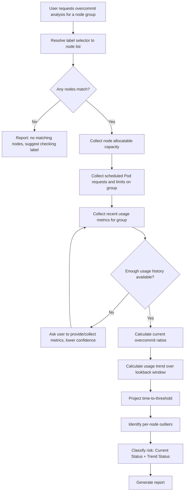

# Skill: Node Group Resource Overcommit Analysis

## Summary

Analyze the aggregate resource allocation and usage of a labeled group of Kubernetes nodes (for example, nodes with label `infra=true`) and warn platform engineers when the group is **already overcommitted**, or is **trending toward overcommitment** in the near future.

The Skill looks at the node group as a single capacity pool: total allocatable CPU/memory versus what has been requested and what is actually being used, then projects forward using recent trend data to flag risk before it becomes an incident.

—

# Problem Statement

Kubernetes schedules Pods based on resource **requests** against node **allocatable** capacity, not on real-time usage. This makes it possible for a group of nodes to look healthy today while quietly approaching a state where:

- New Pods can no longer be scheduled (request-based overcommit / bin-packing exhaustion).
- Nodes experience CPU throttling under load (CPU overcommit).
- Nodes experience memory pressure, evictions, or OOM kills (memory overcommit).

This is especially risky for **purpose-labeled node groups** (e.g. `infra=true`, `role=logging`, `pool=gpu`) that host shared platform services. These groups are often sized once and forgotten, while workload count and resource requests grow over time.

Platform engineers need a way to:

- Check the current commitment level of a labeled node group.
- Understand whether current usage is close to what has been requested (are requests realistic?).
- Get an early warning before the group crosses a capacity threshold, not after.

—

# Scope

## Version 1 Goal

Analyze an **existing, running group of nodes** selected by a Kubernetes label selector.

```
Node group (label selector)
+
Allocatable capacity
+
Scheduled requests/limits
+
Recent usage history
=
Overcommit status + early warning
```

Example invocation:

```
Analyze nodes with label "infra=true" for resource overcommit risk.
```

—

# Analysis Target

## Supported

- A set of nodes selected by one or more label selectors (e.g. `infra=true`, `node-role.kubernetes.io/infra=""`).
- Cluster-wide analysis when no selector is given (treated as a single group: all **untainted** nodes — see Node Group Definition for why tainted nodes are excluded from this default).
- CPU and memory as the analyzed resource dimensions.
- Pod count / max-pods-per-node as a secondary scheduling constraint.

## Not Supported

Version 1 does not analyze:

- Ephemeral storage or extended resources (GPUs, custom device plugins) — noted as a future enhancement.
- Single-pod or single-container sizing (see the Resource Right-Sizing Skill for that).
- Cluster Autoscaler / node pool scale-up decisions — this Skill reports risk, it does not act on it.
- Multi-cluster comparison.

—

# Goals

The Skill should:

- Identify the target node group from a label selector.
- Collect allocatable capacity for every node in the group.
- Collect aggregate Pod resource requests and limits scheduled onto the group.
- Collect recent actual usage (CPU/memory) for the group, including a lookback trend.
- Calculate current overcommit ratios for requests, limits, and actual usage.
- Detect whether the group is already overcommitted.
- Project near-term trend to flag groups that will cross a threshold soon, even if not overcommitted today.
- Separate CPU risk (throttling, usually tolerable) from memory risk (eviction/OOM, usually not tolerable).
- Produce a clear, ranked warning report with supporting evidence.

—

# Analysis Unit

> The unit of analysis is the **node group as a capacity pool**, not an individual node or Pod.

Within that pool, the Skill should still surface **per-node outliers** (e.g. one node in the group already at 95% while the group average is 60%) so engineers aren't misled by averaging effects across the group.

—

# Interactive Workflow



—

# Required Information

## Node Group Definition

Required:

- Label selector (e.g. `infra=true`). If omitted, defaults to all **untainted**
  nodes (see below) rather than every node in the cluster.

Collected per matching node:

- Node name
- Allocatable CPU
- Allocatable memory
- Max Pods
- Ready / schedulable status
- Taints (used to build the default group when no selector is given — see
  below — and also kept informational for labeled-selector runs, explaining
  why only some workloads land on a given node)
- Sum of container CPU/memory requests and limits scheduled onto this node
  (per-node breakdown of the same data collected at group level below —
  required so request/limit outliers can be detected per node, not just
  per-node usage)

### Default Group When No Selector Is Given

Tainted nodes are almost always a deliberately isolated, purpose-specific
pool (dedicated/GPU nodes, spot/preemptible pools, nodes reserved for a
specific team) that only tolerating workloads land on. Lumping them into a
single "all nodes" capacity pool by default would mix unrelated pools
together and produce a meaningless blended ratio — the exact problem this
Skill exists to avoid for purpose-labeled groups.

So when the user does not supply a label selector, the Skill must:

- Resolve the default group as **every node with an empty taint list**
  (`node.spec.taints` is empty), not every schedulable node.
- Exclude any node carrying one or more taints from this default group,
  regardless of effect (`NoSchedule`, `PreferNoSchedule`, `NoExecute`) —
  tainted nodes are only ever included when the user explicitly selects
  them (e.g. a selector or future toleration-aware option targets them).
- State this default explicitly in the report's Assumptions section (which
  nodes were included/excluded and why), the same way an explicit label
  selector is echoed back.
- Still apply the NotReady/Cordoned Nodes handling below on top of this
  default group — the two exclusion rules are independent and both apply.

This default-group rule only applies when no selector is given. An explicit
label selector (e.g. `infra=true`) is honored as-is, including matching
tainted nodes if the selector happens to match them.

### NotReady / Cordoned Nodes

A node matching the label selector but not `Ready`, or marked unschedulable
(cordoned), is not real spare capacity — it cannot absorb new Pods. Counting
its allocatable capacity in the pool would understate overcommit risk.

The Skill must:

- Exclude the allocatable capacity of NotReady/cordoned nodes from the
  capacity pool denominator used in every ratio (request, limit, usage, pod
  count).
- Still include any Pods still scheduled/running on that node in the
  request/limit/usage numerators — the workload hasn't gone away just
  because the node stopped being Ready.
- List excluded nodes by name and reason in the report (Assumptions or
  Missing Information), so the smaller effective pool size is never silent.

—

## Scheduled Workload Data

Required, aggregated across all Pods scheduled onto the group:

- Sum of container CPU requests
- Sum of container CPU limits
- Sum of container memory requests
- Sum of container memory limits
- Pod count

DaemonSet Pods must be included — they are often the biggest hidden contributor to overcommit on infra-labeled node groups (logging agents, CNI, storage agents, monitoring).

## DaemonSet Contribution

```
DaemonSet Request Share (CPU / Memory) =
Sum(DaemonSet Container Requests) / Sum(All Container Requests)
```

This is reported because DaemonSet overhead does not dilute the way regular
workload requests do: adding a node to the group adds allocatable capacity
*and* a proportional share of DaemonSet requests at the same time (one more
copy of every DaemonSet Pod). A group with a high DaemonSet Request Share is
overcommitted mostly by fixed per-node overhead, and "add more nodes" will
not improve its ratio the way it would for a group overcommitted by regular
workloads — this distinction should be called out explicitly in
Recommendations.

—

## Usage Metrics

Required:

- Node-level CPU usage (recent)
- Node-level memory usage (recent)

Preferred observation period:

```
>= 7 days, sampled at a resolution that preserves peak spikes (e.g. 5m)
```

Minimum acceptable:

```
>= 24 hours
```

The Skill should reduce confidence if the observation period is insufficient, same as the trend projection in the next section.

—

# Overcommit Calculation

The Skill evaluates overcommit across three layers, computed independently for CPU and memory, plus one Pod-count dimension that has no CPU/memory split:

```
Layer 1 — Request Overcommit (scheduling risk)
Layer 2 — Limit Overcommit  (burst/OOM risk)
Layer 3 — Usage Overcommit  (real-time pressure)
Pod Count — Scheduling ceiling, independent of CPU/memory
```

## Request Overcommit Ratio

```
Request Overcommit Ratio =
Sum(Container Requests) / Sum(Node Allocatable)
```

Interpretation:

```
Ratio <= 1.0   → Requests fit within allocatable capacity
Ratio >  1.0   → Group cannot schedule its declared requests
                 (new Pods may go Pending)
```

## Limit Overcommit Ratio

```
Limit Overcommit Ratio =
Sum(Container Limits) / Sum(Node Allocatable)
```

Interpretation:

```
CPU:    Ratio > 1.0 is common and often acceptable
        (CPU is compressible — worst case is throttling)

Memory: Ratio > 1.0 is high risk
        (Memory is incompressible — worst case is OOM kill / eviction)
```

## Usage Overcommit Ratio

```
Usage Overcommit Ratio =
P95(Node Group Usage) / Sum(Node Allocatable)
```

This reflects real pressure regardless of what was requested, and is the primary signal for "is this group actually running hot."

## Pod Count Overcommit Ratio

```
Pod Count Overcommit Ratio =
Sum(Pod Count) / Sum(Max Pods)
```

Max-pods-per-node is a scheduling ceiling independent of CPU/memory: a group
can have abundant allocatable CPU/memory left while still being unable to
schedule new Pods because it has hit its Pod count limit. This ratio is
classified using the same OK/Watch/Warning/Overcommitted bands as the
resource ratios (see Risk Classification) and is reported alongside them,
not folded into CPU or memory.

—

# Trend Projection — "Going to Be Overcommitted Soon"

A group that is not overcommitted today can still be flagged if it is approaching a threshold quickly.

## Method

1. Take the request-overcommit ratio and usage-overcommit ratio at regular points over the lookback window (e.g. daily).
2. Fit a simple linear trend to each series.
3. Project the number of days until the ratio crosses the warning threshold (default `0.85`) and the critical threshold (default `1.0`).

```
Projected Days To Threshold =
(Threshold - Current Ratio) / Daily Growth Rate
```

## Warning Conditions

Each label is tied to its own threshold — they are two independent checks,
not two severity bands on a single projection:

```
Trending — Watch:
   Projected Days To (Warning threshold, default 0.85) <= 14
   AND Daily Growth Rate > 0

Trending — Urgent:
   Projected Days To (Critical threshold, default 1.0) <= 7
   AND Daily Growth Rate > 0
```

A ratio can be Trending — Watch on the 0.85 threshold and simultaneously
still be more than 7 days from 1.0 (not yet Urgent), or it can already be
past both checks — report the more severe of the two labels that applies.

If the growth rate is flat or negative, the group is reported as stable regardless of current ratio proximity to threshold.

The Skill must clearly label trend-based warnings as **projections**, distinct from current-state findings (see Risk Classification), and must state the lookback window and assumptions used (linear growth).

## Data Dependency

The usage-overcommit ratio has a natural historical series (node usage
metrics sampled over time). The request-overcommit ratio does not: "Required
Information" only specifies a *current* snapshot of scheduled requests.
Projecting a request-overcommit trend requires historical snapshots of
scheduled requests (e.g. `kube_pod_container_resource_requests` recorded
over time in Prometheus/kube-state-metrics), which is a stronger data
requirement than the current-state calculation.

If historical request/limit snapshots are not available, the Skill must not
fabricate a trend. It should:

- Still project the usage-overcommit ratio (which only needs usage history).
- Report the request/limit trend as "not available" rather than omitting it
  silently, and note it under Missing Information.
- Reduce overall confidence accordingly (see Confidence Model).

—

# Risk Classification

Current-state and trend-based findings are reported as two separate fields
per resource dimension (CPU, memory, Pod count) and layer (request, limit,
usage) — never merged into one classification. A ratio can be `OK` on
Current Status while `Watch`/`Urgent` on Trend Status, and the report must
be able to show that combination.

## Current Status

Based purely on the ratio computed from present-day data:

```
OK             Ratio <  0.70
Watch          0.70 <= Ratio < 0.85
Warning        0.85 <= Ratio < 1.00
Overcommitted  Ratio >= 1.00
```

## Trend Status

Based purely on the trend projection (see Trend Projection), independent of
where the current ratio sits:

```
Stable   No urgent trend (flat/negative growth, or projected days to both
         thresholds exceed the Watch window)
Watch    Trending — Watch (see Warning Conditions)
Urgent   Trending — Urgent (see Warning Conditions)
```

Memory findings at `Warning`/`Overcommitted` (Current Status) or
`Urgent`/`Watch` (Trend Status) should always be surfaced above CPU findings
of the same class — memory pressure has more severe failure modes
(evictions/OOM) than CPU pressure (throttling).

—

# Per-Node Outlier Detection

After computing group-level ratios, the Skill should flag individual nodes whose usage or request ratio deviates significantly from the group average:

```
Outlier Node:
   Node Ratio >= Group Average Ratio + 20 percentage points
```

This prevents a well-balanced group average from hiding one or two hot nodes.

—

# Confidence Model

## High Confidence

- Usage metrics >= 7 days.
- All nodes in the selector returned complete allocatable and usage data.
- DaemonSet requests included in the aggregation.

## Medium Confidence

- Usage metrics between 24 hours and 7 days, or
- A small number of nodes (<10% of group) missing metrics.

## Low Confidence

- Usage metrics < 24 hours, or
- Scheduled request/limit data unavailable (ratios based on usage only), or
- Trend projection based on fewer than 3 data points.

—

# Expected Output

The Skill should generate a Markdown report.

Structure:

```
# Executive Summary
  - Headline status: the single most severe Current Status or Trend Status
    found across every resource/layer/Pod-count classification (worst-case
    rollup — e.g. one Overcommitted memory-usage finding makes the headline
    Overcommitted even if every other layer is OK)
  - One-line reason pointing at which resource/layer drove the headline

# Node Group
  - Label selector
  - Node count (and any nodes excluded as NotReady/cordoned)
  - Total allocatable CPU / Memory

# Current Overcommit Status
  - Request Overcommit Ratio (CPU / Memory)
  - Limit Overcommit Ratio (CPU / Memory)
  - Usage Overcommit Ratio (CPU / Memory)
  - Pod Count Overcommit Ratio
  - Current Status per resource/layer (see Risk Classification)

# Trend Projection
  - Growth rate per resource/layer
  - Projected days to Warning threshold (0.85) / Critical threshold (1.0)
  - Trend Status per resource/layer (see Risk Classification) — always
    labeled as a projection, never merged with Current Status

# Per-Node Outliers

# DaemonSet Contribution

# Recommendations
  - e.g. add nodes, rebalance workloads, right-size requests, adjust label selector membership

# Assumptions

# Missing Information
```

—

# Success Criteria

A successful analysis should:

- Correctly resolve the label selector to the intended node group, or default to all untainted nodes when no selector is given.
- Exclude NotReady/cordoned nodes' capacity from the pool while still counting any Pods still running there.
- Include DaemonSet Pods in aggregation.
- Report request, limit, and usage overcommit separately.
- Distinguish CPU risk from memory risk in both language and ranking.
- Clearly separate "overcommitted now" (Current Status) from "trending toward overcommitted" (Trend Status) as two distinct fields, never merged.
- Roll up to a single worst-case headline status in the Executive Summary without hiding the per-layer detail.
- Identify per-node outliers, not just the group average.
- State confidence and data limitations explicitly.

—

# Out of Scope

Version 1 does not:

- Automatically add/remove nodes or resize node pools.
- Configure or trigger Cluster Autoscaler.
- Modify workload resource requests/limits.
- Analyze extended resources (GPU, ephemeral storage) or custom device plugins.
- Compare overcommit across multiple clusters.

—

# Future Enhancements

Possible improvements:

- Ephemeral storage and extended resource overcommit.
- Direct Cluster Autoscaler / Karpenter integration for automated remediation suggestions.
- Cost impact estimation for adding capacity vs. right-sizing workloads.
- Multi-selector comparison (e.g. compare `infra=true` vs `infra=false` pools).
- Seasonal/periodic trend detection instead of simple linear projection.
- Automated Slack/alertmanager notification integration.
