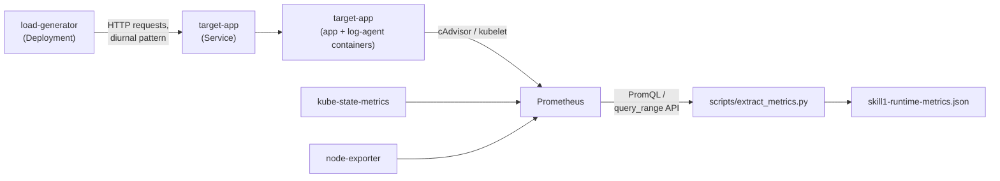

# Test Environment: k3s + Prometheus for skill1 Validation

This folder sets up a real, minimal Kubernetes environment for validating
**skill1** (`docs/PRD/skill1.md`, `docs/specs/skill1-technical-spec.md`,
`docs/plan.md` — Kubernetes Resource Right-Sizing) against live cluster data
instead of only synthetic fixtures.

skill1 needs a running workload plus **historical** CPU/memory metrics
(minimum 24h, preferred 7 days). `metrics-server` (k3s's default) only
exposes current usage, so this setup adds a lightweight Prometheus +
kube-state-metrics stack to retain history, a target workload with
deliberately mis-sized resources, and a synthetic load generator that drives
a diurnal (day/night) traffic pattern so the resulting metrics have
realistic variability.

—

## Architecture

—

## Steps

| # | Doc | What it does | Est. time |
|---|---|---|---|
| 1 | [01-provision-server.md](01-provision-server.md) | Size and prep a 2 vCPU Ubuntu server | 15 min |
| 2 | [02-install-k3s.md](02-install-k3s.md) | Install a lightweight k3s | 10 min |
| 3 | [03-install-monitoring-stack.md](03-install-monitoring-stack.md) | Install Prometheus + kube-state-metrics (no Grafana/Alertmanager) | 15 min |
| 4 | [04-deploy-target-workload.md](04-deploy-target-workload.md) | Deploy the workload skill1 will analyze (2 containers, mis-sized on purpose) | 10 min |
| 5 | [05-deploy-synthetic-load-generator.md](05-deploy-synthetic-load-generator.md) | Deploy traffic that drives realistic, time-varying usage | 10 min |
| — | **Wait** | Let 5 run continuously | ≥24h, ideally 7 days |
| 6 | [06-collect-metrics-for-skill1.md](06-collect-metrics-for-skill1.md) | Pull the accumulated history into skill1's input JSON shape | 15 min |

Reusable Kubernetes manifests live in `manifests/`; the metrics extractor
lives in `scripts/extract_metrics.py` (stdlib-only, no pip installs needed).

—

## Prerequisites

- A server with **2 vCPU / 4GB RAM minimum**, Ubuntu 22.04 LTS. RAM is the
  tighter constraint of the two once Prometheus is running — see
  `01-provision-server.md` for a lower-memory fallback.
- `kubectl` and `helm` on whichever machine you'll drive the cluster from
  (can be the server itself, or your laptop once kubeconfig is copied over —
  see `02-install-k3s.md`).
- SSH access to the server.

—

## What you end up with

- A `skill1-runtime-metrics.json` file (per-container CPU/memory sample
  series + OOM events, matching spec §4.2) covering whatever observation
  window you waited for.
- A hand-assembled `workload-config.json` (spec §4.1 shape) built from
  `kubectl get deployment` output — shown in step 6.

Together these are exactly the two inputs skill1's `VALIDATE` state expects
(spec §3), so once `skills/k8s-resource-right-sizing/` exists (per
`docs/plan.md`) you can paste them straight into a conversation invoking it.

—

## Cost note

Step 1 provisions a real cloud VM that then runs continuously for up to 7
days (step 5's wait). Remember to stop or delete it once you've captured
`skill1-runtime-metrics.json` in step 6 — nothing in this folder tears it
down automatically.
